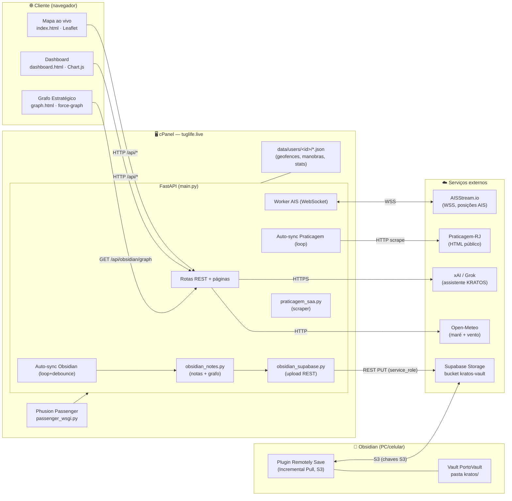
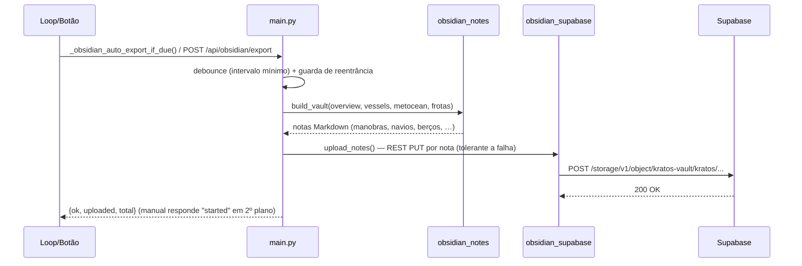

# KRATOS — Arquitetura & Implantação (Documento do Desenvolvedor)

**Autor:** Jossian Brito

> Documento técnico de referência do **KRATOS — Inteligência Naval Estratégica**.
> Cobre arquitetura, diagrama de implantação, árvore de diretórios, fluxos de
> dados, endpoints, variáveis de ambiente e procedimento de deploy (cPanel).
>
> **Produção:** `https://tuglife.live/aisstream/` · **Deploy:** Git pull em `main`.

---

## 1. Visão geral

O KRATOS monitora o tráfego AIS do Porto do Rio de Janeiro / Baía de Guanabara,
cruza com a **programação da Praticagem-RJ** e produz inteligência estratégica
(market share, manobras SAAM × concorrentes, geofences, clima/maré). Os dados
são expostos em três frentes:

1. **Mapa ao vivo** (Leaflet) — posições AIS em tempo real.
2. **Painel estratégico** (Dashboard) — tabelas, gráficos e o assistente KRATOS.
3. **Grafo Estratégico** — rede de relações (Manobra ↔ Navio ↔ Berço ↔
   Rebocador ↔ Empresa ↔ Dia), nativa no app **e** sincronizável no Obsidian.

Pilha: **FastAPI (ASGI)** sob **Phusion Passenger** no cPanel; frontend estático
(HTML/JS, Leaflet, Chart.js, force-graph); persistência em arquivos JSON por
usuário; integrações externas via HTTP/WebSocket. **Sem banco de dados** e, no
backend, **sem dependências além de FastAPI/uvicorn/websockets/bs4** (uploads e
chamadas externas usam `urllib` da stdlib).

---

## 2. Diagrama de implantação



**Pontos-chave da topologia**
- O backend escreve no Supabase via **REST API de Storage** (chave `service_role`,
  `Authorization: Bearer`). O Obsidian lê via **protocolo S3** (chaves S3
  dedicadas). São credenciais distintas para o mesmo bucket privado.
- As três *background tasks* rodam **dentro do event loop** do FastAPI
  (compatível com o reciclo de workers do Passenger) — nunca como processos à
  parte. Ver `@app.on_event("startup")`.
- O grafo nativo (`graph.html`) e o vault do Obsidian derivam da **mesma
  função-fonte** (`obsidian_notes`), garantindo que mostrem a mesma rede.

---

## 3. Fluxos de dados

### 3.1 AIS (tempo real)
`AISStream (WSS)` → `Worker AIS` → `latest_vessel_by_mmsi` (memória) →
classificação de geofences, frota SAAM, milhas náuticas → snapshot em disco
(`vessels_snapshot.json`) → `GET /api/vessels` → Mapa.

### 3.2 Praticagem (programação)
Loop a cada `PRATICAGEM_AUTO_SYNC_SECONDS` → `praticagem_saa.py` raspa o HTML
público → normaliza manobras (EMP.RB, berço, POB, calado/LOA/boca…) → grava
`saa_maneuvers.json` → alimenta market share, indicadores e o grafo. **SAA = SAAM**
(nossa empresa); `WIL`/`CAM` são concorrentes.

### 3.3 Exportação Obsidian


### 3.4 Grafo nativo
`GET /api/obsidian/graph` → `obsidian_notes.build_graph(...)` → `{nodes, links}`
com `group` por tipo e `val` por grau → `graph.html` (force-graph) colore e
enquadra a rede.

---

## 4. Árvore de diretórios

```text
aisstream_app/
├── main.py                     # Backend FastAPI: rotas, workers, geofences,
│                               #   praticagem, market share, KRATOS/xAI, Obsidian
├── obsidian_notes.py           # Motor de notas + build_graph (modelo do grafo)
├── obsidian_supabase.py        # Upload REST p/ Supabase Storage (stdlib urllib)
├── praticagem_saa.py           # Scraper da Praticagem-RJ
├── passenger_wsgi.py           # Entrada do Phusion Passenger (cPanel)
├── Procfile                    # uvicorn (execução fora do cPanel)
├── requirements.txt            # fastapi, uvicorn, websockets, beautifulsoup4, dotenv
├── .cpanel.yml                 # Deploy cPanel (DEPLOYPATH)
├── .env.example                # Modelo de variáveis de ambiente
├── .gitignore                  # Ignora dados de runtime e segredos
├── CLAUDE.md                   # Regras de trabalho do projeto
├── DEPLOY_CPANEL.md            # Guia de deploy / troubleshooting
├── README.md / CHANGELOG.md
│
├── .vscode/                    # launch.json, tasks.json
│
├── frontend/
│   ├── index.html              # Mapa Leaflet ao vivo (+ botões DB e GR)
│   ├── dashboard.html          # Painel estratégico + Manual do usuário
│   ├── graph.html              # 🕸️ Grafo Estratégico (force-graph)
│   └── app-config.js           # Config do front (API_BASE etc.)
│
├── data/
│   └── users/<id>/             # <id> = DASHBOARD_USER_ID (ex.: "default")
│       ├── geofences.json              # VERSIONADO (geometrias do usuário)
│       ├── saa_maneuvers.json          # runtime (gitignored)
│       ├── tug_geofence_stats.json     # runtime (gitignored)
│       ├── saa_schedule_monitor.json   # runtime (gitignored)
│       ├── strategy_memory.json        # runtime (gitignored)
│       └── vessels_snapshot.json       # runtime (gitignored)
│
└── docs/
    ├── ARQUITETURA_E_IMPLANTACAO.md        # (este documento)
    ├── MANUAL_GRAFO_E_FUNCIONALIDADES.md   # documento do usuário
    ├── PROPOSTA_KRATOS.md
    ├── PROPOSTA_OBSIDIAN_KRATOS.md
    ├── OBSIDIAN_REMOTELY_SAVE_TUTORIAL.md  # configuração do Obsidian
    ├── DEPLOY_PULL_CPANEL.md
    ├── faq.md
    ├── api/ (openapi.yaml, README.md)
    └── relatorios/                          # relatórios de etapa (01..07)
```

> **Runtime gitignored:** os arquivos por usuário (exceto `geofences.json`) são
> escritos pela app em produção e **não** versionados — versioná-los quebra o
> deploy do cPanel (que exige working tree limpa). Ver `DEPLOY_CPANEL.md`.

---

## 5. Módulos do backend

| Módulo | Responsabilidade | Dependências |
|--------|------------------|--------------|
| `main.py` | App FastAPI, rotas, 3 workers de fundo, regras de geofence/market share, assistente KRATOS, orquestração Obsidian. | fastapi, websockets, bs4, stdlib |
| `obsidian_notes.py` | **Modelagem**: gera notas Markdown interligadas e `build_graph()` (nós/arestas). Puro/testável, não importa `main`. | stdlib |
| `obsidian_supabase.py` | **Transporte**: `upload_note(s)`, `build_note` (frontmatter), `check_connection` via REST de Storage. | stdlib (`urllib`) |
| `praticagem_saa.py` | Scraper e parser da programação pública da Praticagem-RJ. | bs4 |

Separação intencional **modelagem (notes) × transporte (supabase)** — espelha as
seções 1 e 2 da `PROPOSTA_OBSIDIAN_KRATOS.md`.

---

## 6. Endpoints (REST)

| Método | Rota | Função |
|--------|------|--------|
| GET | `/` | Mapa ao vivo (index.html) |
| GET | `/dashboard` `/dashboard.html` | Painel (HTML com bootstrap embutido) |
| GET | `/graph` | Página do Grafo Estratégico |
| GET | `/api/status` | Estado do relay/AIS |
| GET | `/api/vessels` | Embarcações (since/limit/snapshot) |
| GET | `/api/areas` | Áreas disponíveis |
| GET | `/api/dashboard/overview` | Agregado do painel (manobras, market share, geofences, concorrentes) |
| GET | `/api/geofences` · `/occupancy` · `/{id}/vessels` | Geofences e ocupação |
| POST | `/api/geofences` | Salvar geofences |
| GET/POST | `/api/dashboard/saa-maneuvers` | Listar / inserir manobra |
| POST | `/api/…/sync-praticagem-saa` (+ aliases) | Sincronizar Praticagem |
| POST | `/api/dashboard/strategy-assistant` | Assistente KRATOS (xAI) |
| GET | `/api/kratos/insights` | Insights por regras |
| GET | `/api/obsidian/status` | Diagnóstico da ponte Supabase (autoSync, lastExport) |
| POST | `/api/obsidian/test-upload` | Teste de conexão (nota de saúde) |
| POST | `/api/obsidian/export` | Exporta vault (2º plano; `?wait=1` síncrono) |
| GET | `/api/obsidian/graph` | Nós/arestas do grafo |
| GET | `/healthz` | Health check |

> Rotas espelhadas sob `/dashboard/api/...` existem para compatibilidade com o
> proxy. Especificação completa em `docs/api/openapi.yaml`.

---

## 7. Variáveis de ambiente

| Variável | Uso |
|----------|-----|
| `PORT` | Porta (uvicorn) |
| `AIS_MODE` | `live` / `mock` |
| `AISSTREAM_API_KEY` | Chave do AISStream |
| `DEFAULT_AREA` | Área inicial (`rio`) |
| `DASHBOARD_USER_ID` | Usuário-fonte dos dados (`default`) |
| `PRATICAGEM_RJ_URL` | URL da programação |
| `PRATICAGEM_AUTO_SYNC_SECONDS` | Intervalo do sync da Praticagem |
| `XAI_API_KEY` / `XAI_MODEL` / `ASSISTANT_PROFILE` | Assistente KRATOS |
| `SUPABASE_URL` / `SUPABASE_KEY` / `SUPABASE_BUCKET` | Backend → Supabase (REST) |
| `OBSIDIAN_NOTE_PREFIX` | Pasta das notas (`kratos`) |
| `OBSIDIAN_AUTO_SYNC` / `OBSIDIAN_AUTO_SYNC_SECONDS` | Liga/intervalo do auto-export |
| `SUPABASE_S3_ACCESS_KEY` / `SUPABASE_S3_SECRET_KEY` | Usadas pelo **Obsidian** (não pelo backend) |

Modelo completo: `.env.example`. Segredos **não** são versionados (`.env`
gitignored).

---

## 8. Deploy (cPanel)

Fluxo padrão (produção puxa de `main`):

```bash
cd ~/aisstream_app
git pull origin main          # ou: git merge origin/main --no-edit
touch tmp/restart.txt         # recicla o worker do Passenger
```

**Validações antes de commitar** (regra do projeto):
```bash
python3 -c "import ast; ast.parse(open('main.py').read())"   # backend
node --check <script-extraido-do-html>                       # front alterado
```

### Atenção operacional — divergência do `main` local
O `main` no servidor pode conter **commits locais não enviados ao GitHub**
(ex.: ajustes feitos direto em produção). Nesses casos:
- `git pull` pode falhar com *"divergent branches"* → use `git merge origin/main --no-edit`.
- Para aplicar **apenas um commit** sem reconciliar tudo: `git cherry-pick <hash>`
  (aditivo, baixo risco; `git cherry-pick --abort` mantém o site no ar).
- Se o working tree quebrar no meio de um merge (marcadores `<<<<<<<`):
  `git merge --abort` ou `git reset --hard <commit-bom>` restaura o serviço.
- **Recomendado a médio prazo:** alinhar o servidor ao GitHub (`reset --hard
  origin/main`) preservando `geofences.json`, para encerrar a divergência.

### Sobre as tarefas de fundo no Passenger
São iniciadas em `startup_event()` e canceladas em `shutdown_event()`. O
`touch tmp/restart.txt` é o gatilho de reinício; novas conexões AIS, o sync da
Praticagem e o auto-export do Obsidian voltam a rodar automaticamente.

---

## 9. Convenções e regras

- **SAA = SAAM** (nossa empresa) na programação; `WIL`/`CAM` concorrentes.
- O assistente estratégico chama-se **KRATOS**.
- **Atualizar o Manual do usuário** (`dashboard.html`) a cada feature visível.
- **Relatório de etapa** em `docs/relatorios/` ao concluir cada etapa.
- Dados de runtime (`data/users/*`) são gitignored.

Detalhes em `CLAUDE.md`.
