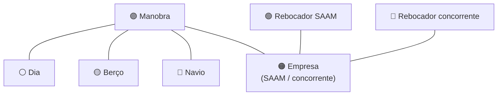

# KRATOS — Grafo Estratégico & Funcionalidades (Guia do Usuário)

**Autor:** Jossian Brito

> Guia de **uso** do KRATOS, com foco no **Grafo Estratégico**: o que é, como
> ler, como navegar e como usar no dia a dia da operação. Inclui também um
> panorama das funcionalidades atuais e das **aplicações futuras**.
>
> Acesso: `https://tuglife.live/aisstream/` → botões **🕸️ Gráfico** (painel) e
> **GR** (mapa), ou direto em `…/aisstream/graph`.

---

## 1. O que é o KRATOS

O **KRATOS** é o centro de **inteligência naval estratégica** da operação na
Baía de Guanabara. Ele junta, em um só lugar:

- as **posições AIS** ao vivo (rebocadores e navios);
- a **programação da Praticagem-RJ** (manobras previstas);
- o **clima e a maré** (vento e nível do mar);
- e a leitura de **market share** — SAAM × concorrentes (Wilson, Camorim).

Tudo isso é apresentado de três formas complementares: o **Mapa ao vivo**, o
**Painel estratégico** e — a novidade — o **Grafo Estratégico**.

---

## 2. O Grafo Estratégico

O Grafo mostra a operação como uma **rede de conexões**: cada manobra, navio,
berço, rebocador, empresa e dia vira um **ponto (nó)**, e as **linhas** mostram
como eles se relacionam. É a mesma visão que existe no Obsidian, agora **dentro
do próprio KRATOS**, atualizada ao vivo.

### 2.1 Como ler as cores

| Cor | Tipo | O que representa |
|-----|------|------------------|
| 🟢 Verde | Rebocador **SAAM** | Nossa frota (SAAM-BGRA) |
| 🔴 Vermelho | Rebocador **concorrente** | Frotas WIL / CAM |
| 🔵 Azul | **Navio** | Navio comercial (histórico + posição) |
| 🟡 Amarelo | **Berço** | Local de atracação/manobra |
| 🟣 Roxo | **Manobra** | Uma manobra da programação |
| 🟠 Laranja | **Empresa** | SAAM e concorrentes (hubs) |
| ⚪ Cinza | **Dia** | Condições e manobras de um dia |

> **Tamanho do ponto:** quanto **mais conexões** um nó tem, **maior** ele
> aparece. Por isso empresas e o "dia" costumam ser os maiores — são os
> centros que puxam várias manobras.

### 2.2 Como ler as conexões

- Uma **manobra** (roxo) se conecta ao **navio** que vai manobrar, ao **berço**
  de destino, à **empresa** responsável e ao **dia** em que ocorre.
- Um **rebocador** (verde/vermelho) se liga à sua **empresa**.
- Seguindo as linhas, você enxerga rapidamente, por exemplo, *quais navios e
  berços concentram manobras*, ou *onde a SAAM está mais presente que os
  concorrentes*.

### 2.3 Controles

| Ação | Como fazer |
|------|------------|
| **Mover** o grafo | Arrastar com o mouse |
| **Zoom** | Roda do mouse (aproxima/afasta) |
| **Ver o nome** de um nó | Aproximar o zoom (os rótulos aparecem) ou passar o mouse |
| **Focar** num nó | Clicar nele (centraliza e dá zoom) |
| **Recarregar** | Botão **↻ Atualizar** (traz o estado mais recente) |
| **Voltar** | **← Painel** ou **Mapa** no topo |

O contador no canto superior mostra **quantos nós e conexões** estão na tela.

---

## 3. Como usar no dia a dia (casos de uso)

- **Panorama de market share em segundos:** abra o grafo e veja, pelas cores,
  onde está a **SAAM (verde)** e onde estão os **concorrentes (vermelho)**.
- **Dossiê por navio:** clique no nó de um navio para focar — você vê todas as
  manobras ligadas a ele e os berços envolvidos.
- **Leitura do dia:** o nó **cinza** do dia concentra as manobras e as condições
  (vento/maré) daquele dia — ótimo para o briefing operacional.
- **Concorrência por empresa:** os nós laranja (SAAM, WIL, CAM) mostram, pelas
  ligações, o volume de manobras de cada uma.
- **Pontos de pressão:** berços (amarelo) muito conectados indicam **gargalos**
  de atracação; navios muito conectados, **recorrência** de operação.

> O grafo é **gerado ao vivo** a partir do estado atual (AIS + Praticagem).
> Conforme a programação muda, o grafo acompanha — basta **Atualizar**.

---

## 4. Integração com o Obsidian (opcional)

Além do grafo nativo, o KRATOS pode **exportar** a mesma rede como **notas
Markdown** para o seu Obsidian (via Supabase + plugin *Remotely Save*). Vantagens:

- abrir o **mesmo grafo** no Obsidian, no computador **e no celular**;
- navegar por **dossiês ricos** (cada navio, berço, rebocador e dia vira uma
  nota com links e dados);
- usar o **Graph View** do Obsidian com cores por tag (`#kratos/...`).

A sincronização é **automática** (servidor → Supabase a cada poucos minutos) e o
botão **"Sincronizar Obsidian (Supabase)"** no painel força um envio imediato.
Passo a passo de configuração: `docs/OBSIDIAN_REMOTELY_SAVE_TUTORIAL.md`.

> **Boa prática:** no Obsidian, não edite os arquivos dentro da pasta `kratos/`
> — eles são **regerados** pelo KRATOS. Suas anotações livres ficam fora dela.

---

## 5. Demais funcionalidades do KRATOS

- **Mapa ao vivo:** ícones no padrão AIS (seta = rumo), cores por tipo, brilho
  dourado para a frota SAAM, anel vermelho para concorrentes, e destaque dos
  navios que a SAAM vai manobrar.
- **Painel estratégico:** status das geofences, manobras SAA (com destaque por
  horário POB), frota SAAM (manobras e horas em geofence), **market share** por
  janela (hoje / 7 / 30 dias) e o **monitor de alterações** da programação.
- **Assistente KRATOS (xAI):** responde perguntas estratégicas (concorrentes
  manobrando, riscos de vento/maré, alocação de rebocadores) e gera relatórios.
- **Insights ao vivo** no mapa: leitura datilografada do cenário (manobras,
  rebocadores na base, maré, vento, simultaneidade, market share).

---

## 6. Aplicações futuras (roadmap de ideias)

Ideias já mapeadas para evoluir o grafo e a inteligência do KRATOS:

1. **Filtros no grafo:** mostrar só SAAM × concorrentes, por empresa, por dia,
   ou por tipo de nó; e **busca** por nome de navio/berço.
2. **Alertas de simultaneidade** destacados no grafo e na nota do dia (quando
   várias manobras concorrem pelo mesmo horário/recurso).
3. **ETA e distância à barra** por navio, transformando o grafo em apoio à
   **priorização de alocação** de rebocadores.
4. **Linha do tempo:** "rebobinar" o grafo por dia/semana para ver a evolução
   do market share e da ocupação de berços.
5. **Indicadores no nó:** tamanho/cor por calado, LOA ou nº de rebocadores
   estimados — leitura de risco direto no ponto.
6. **Exportações e relatórios:** PNG/PDF do grafo e resumo executivo automático
   por período.
7. **Camada preditiva:** sinalizar tendências (ex.: berços/janelas com maior
   probabilidade de disputa) a partir do histórico acumulado.

> Qualquer um desses itens pode ser priorizado conforme a necessidade
> operacional — a base (dados ao vivo + modelo de grafo) já está pronta.

---

## 7. Perguntas rápidas

- **O grafo atualiza sozinho?** Ele reflete o estado atual a cada carregamento;
  use **↻ Atualizar** para puxar o mais recente. No Obsidian, a sincronização é
  automática a cada poucos minutos.
- **Preciso do Obsidian para usar o grafo?** Não. O grafo nativo funciona direto
  no site. O Obsidian é um **extra** para mobilidade e dossiês.
- **As cores significam o quê mesmo?** Verde = SAAM, vermelho = concorrente,
  azul = navio, amarelo = berço, roxo = manobra, laranja = empresa, cinza = dia.

---

*KRATOS — Inteligência Naval Estratégica · Porto do Rio de Janeiro / Baía de
Guanabara.*
